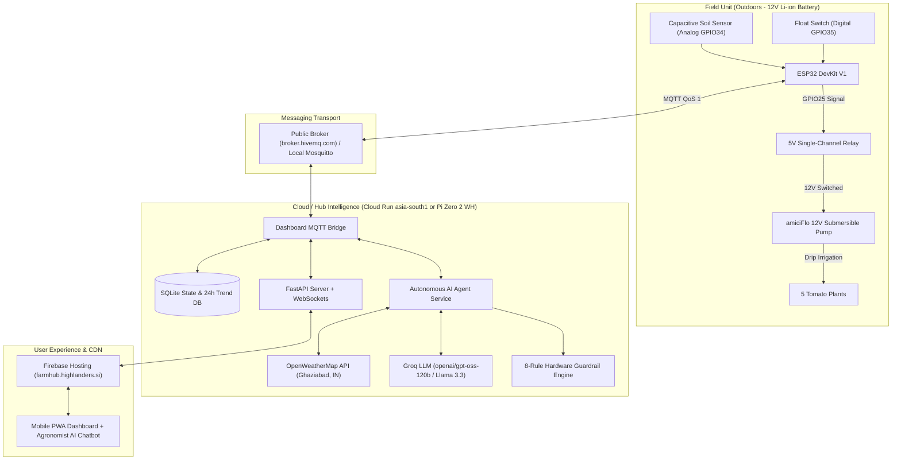

# 🍅 FarmHub: Autonomous Closed-Loop Farm Irrigation & Agronomist AI

[](https://www.python.org/)
[](https://cloud.google.com/run)
[](https://firebase.google.com/)
[](https://groq.com/)
[](tests/)
[](https://hivemq.com/)

An end-to-end **Agentic AI IoT System** that autonomously monitors and irrigates **5 tomato plants** with **zero humans in the loop**.

Combines real-time physical capacitive soil moisture sensing and water reservoir telemetry with **Groq LLM agronomic reasoning**, live OpenWeatherMap precipitation forecasts, **8 code-level safety guardrails**, closed-loop verification, and an **interactive Agronomist AI Chatbot**.

---

## 🌐 Live Production Deployments

* 🌍 **Production Custom Domain:** [**https://farmhub.highlanders.si**](https://farmhub.highlanders.si)
* ⚡ **Firebase Global CDN Proxy:** [**https://highlanders-farmhub.web.app**](https://highlanders-farmhub.web.app)
* ☁️ **Google Cloud Run Instance:** `farmhub-agent` (`asia-south1` Mumbai, scale-to-zero free tier)

---

## ⚡ System Architecture



---

## 📋 Key Features

### 1. 🧠 Autonomous Agentic Decision Loop
* Evaluates soil telemetry every **2 minutes**.
* Bundles live moisture %, battery voltage, drum level, weather forecast, and recent moisture trends into an agronomy prompt.
* Primary reasoning powered by **Groq** (`openai/gpt-oss-120b` and `llama-3.3-70b-versatile`) with resilient fallback to OpenAI, Gemini Flash, or deterministic agronomy rules.

### 2. 🛡️ 8 Bulletproof Code Safety Guardrails
The AI never touches the pump directly. All LLM proposals pass through a strict code policy engine:
1. **Drum Safety (Dry-Run Lock):** Hard veto if drum water level is `LOW`.
2. **Over-Moisture Protection:** Hard veto if soil moisture is already `≥ 70%`.
3. **Precipitation Hold:** Vetoes watering if rain probability in the next 3 hours is `> 50%` and soil is `> 20%`.
4. **Minimum Cooldown Window:** Enforces a minimum **2.0-hour spacing** between waterings.
5. **Daily Quota Cap:** Hard ceiling of maximum **4 waterings in any rolling 24-hour window**.
6. **Battery Low Voltage Cutoff:** Blocks pump actuation if battery `< 11.0V` to prevent 3S Li-ion cell damage and ESP32 brownout reboots.
7. **Sensor Fault Bounds:** Blocks pump if raw ADC is `< 500` or `> 3600` (detects unplugged or shorted sensor wires so crops are never drowned).
8. **Consecutive Anomaly Lockout (Burst Pipe Protection):** If closed-loop verification fails twice consecutively (pump ran but soil never got wet), suspends automation until inspected.

### 3. 💬 Interactive FarmHub Agronomist AI Chatbot
* Built-in slide-over drawer accessible directly from the mobile dashboard.
* Injected with real-time sensor context, battery voltage, Ghaziabad weather, and recent irrigation audit trails.
* Features quick-tap prompt chips:
  * `🌱 Plant Health` (analyzes hydration & tomato care advice)
  * `💧 Last Decision` (explains why watering happened or was skipped)
  * `🌤️ Weather & Rain` (checks 3h precipitation forecast)
  * `🔋 Battery & Drum` (inspects reservoir and battery voltage)

### 4. 🔄 Closed-Loop Verification
* Automatically schedules a verification check ~15 minutes after each watering.
* If soil moisture does not increase by at least **+8%**, flags an `ANOMALY` alert on the dashboard and logs a potential line leak.

---

## 📦 Hardware Bill of Materials (BOM)

| Component | Product Specification | Role |
|---|---|---|
| **Field Brain** | Robocraze ESP32 DevKit V1 (30-pin, CP2102) | Microcontroller reading sensors and triggering relay |
| **Water Pump** | amiciFlo 12V DC Mini Submersible Pump (240 L/H, 3M lift) | Submerged inside 50L drum; feeds drip lines |
| **Soil Sensor** | SmartElex Capacitive Soil Moisture Sensor v1.2 | Corrosion-resistant analog soil measurement |
| **Water Level** | OCEAN STAR Float Switch Sensor with 3m Wire | Detects drum reservoir water level |
| **Relay** | Robocraze 4-Channel 5V Optocoupler Relay Board | Isolates ESP32 and switches 12V power to pump |
| **Field Battery** | CONSONANTIAM 12V Li-ion Battery (5000mAh 3S w/ BMS) | Main field power source |
| **Step-Down** | Electronic Spices LM2596 DC-DC Buck Converter | Regulates 12V down to stable 5.0V for ESP32 & relay |
| **Electrical Safety** | 1N4007 Diode + 10kΩ Resistor + In-Line Blade Fuse | Flyback spike snubbing, float pull-up & short-circuit safety |
| **Enclosure** | ABS Junction Box (150 × 110 × 70 mm, IP65) | Outdoor weatherproof enclosure with PG7 glands |

---

## ⚡ Field Relay Box Wiring Diagram

```text
12V Battery (+) ──► [In-line Fuse] ──┬──► Relay COM
                                    └──► LM2596 IN+ ──► OUT+ (5.0V) ──► ESP32 VIN & Relay VCC
12V Battery (-) ────────────────────┬──► LM2596 IN- ──► OUT- (GND)  ──► ESP32 GND & Common Ground
                                    └──► Pump (-)

Relay NO ──────────────────────────────► Pump (+) [1N4007 Flyback Diode across Pump +/-]
ESP32 GPIO25 ──────────────────────────► Relay IN

Soil Sensor AOUT ──────────────────────► ESP32 GPIO34 (Analog ADC)
Soil Sensor VCC  ──────────────────────► ESP32 3.3V
Soil Sensor GND  ──────────────────────► ESP32 GND

Float Switch Wire 1 ───────────────────► ESP32 GPIO35 (Digital with 10kΩ pull-up to 3.3V)
Float Switch Wire 2 ───────────────────► ESP32 GND
```

---

## 🚀 Quickstart & Testing

### 1. Run Automated Unit Tests (22 Tests)
```powershell
python -m pytest tests/ -v
```
Verifies guardrail policies, low-battery lockouts, sensor fault limits, consecutive anomaly handling, API status endpoints, and conversational chatbot responses.

### 2. Desktop Simulation (No Hardware Needed)
To test the entire closed-loop system locally:

* **Terminal 1 — Run the Mock ESP32 Simulator:**
  ```powershell
  python simulator/mock_esp32.py --host broker.hivemq.com --interval 5 --initial-moisture 28.0
  ```
* **Terminal 2 — Run the Unified Server:**
  ```powershell
  python main.py
  ```
* Open **`http://localhost:8080`** in your browser.

### 3. Deploying to Google Cloud Run
Deploy updates directly to Cloud Run with zero-cost scale-to-zero:
```powershell
powershell -ExecutionPolicy Bypass -File .\deploy\deploy_cloud_run.ps1
```

---

## 📊 API & MQTT Topic Contract

| Topic / Endpoint | Protocol | Purpose |
|---|---|---|
| `farm/soil/moisture` | MQTT QoS 1 | Periodic soil moisture % and raw ADC telemetry |
| `farm/drum/level` | MQTT QoS 1 | Float switch reservoir status (`OK` or `LOW`) |
| `farm/pump/command` | MQTT QoS 1 | Actuation commands (`{"action": "RUN", "duration_sec": 30}`) |
| `farm/status/heartbeat`| MQTT QoS 1 | Field battery voltage and RSSI telemetry |
| `POST /api/chat` | REST HTTP | Conversational query endpoint for FarmHub Agronomist AI |
| `POST /api/evaluate-now`| REST HTTP | Forces an immediate AI evaluation cycle |
| `GET /api/history` | REST HTTP | 24-hour historical sensor trend points |
| `GET /api/status` | REST HTTP | Live telemetry snapshot and controller status |

---

## 🔒 Security & Secrets

* Secrets (`GROQ_API_KEY`, `OPENWEATHER_API_KEY`, `OPENAI_API_KEY`) are managed via `.env` and injected into Cloud Run environment variables.
* Secrets are strictly git-ignored via [`.gitignore`](.gitignore). A template is provided in [`.env.example`](.env.example).

---

## 📄 License
MIT License. Free for open-source and personal DIY agriculture automation.
