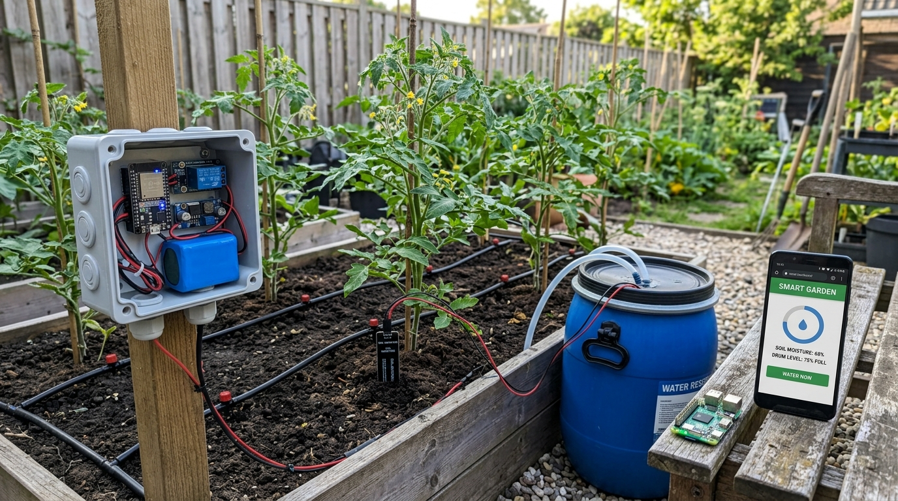
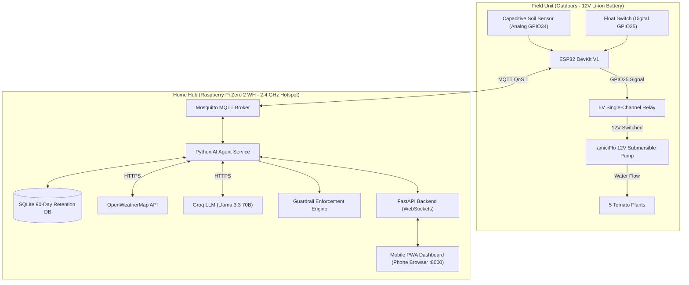

# 🍅 AgriAgent: Autonomous Closed-Loop Farm Irrigation POC

[](https://www.python.org/)
[](https://platformio.org/)
[](https://fastapi.tiangolo.com/)
[](https://mosquitto.org/)
[](https://groq.com/)
[](#hardware-bill-of-materials)

An end-to-end **Agentic AI IoT system** that autonomously monitors and waters **5 tomato plants** with **zero humans in the loop**. 

Combines physical capacitive soil moisture sensing and water drum float telemetry with **Groq LLM agronomy reasoning**, local weather precipitation forecasts, strict **code-level safety guardrails**, and **closed-loop verification** that confirms moisture actually rose after watering.

---

## 📸 Prototype Layout



---

## ⚡ System Architecture & Message Flow




---

## 📋 Features

- 🧠 **Autonomous Agentic Decision Loop:** Queries Groq (`llama-3.3-70b-versatile` with Google Gemini Flash fallback) with recent moisture trends, current weather, and 3-hour precipitation probability.
- 🛡️ **Absolute Code Guardrails:** Hard code safety engine that vetoes any unsafe AI suggestion:
  - **Dry-Run Protection:** Blocks pump run if drum level is `LOW`.
  - **Oversaturation Protection:** Blocks watering if soil moisture is already `≥ 70%`.
  - **Cooldown Window:** Enforces minimum 2.0 hours between waterings.
  - **Daily Quota:** Hard cap of maximum 4 waterings in a rolling 24-hour window.
  - **Runtime Clamping:** Clamps pump activation strictly between 10s and 45s.
- 🔄 **Closed-Loop Verification:** Automatically checks soil moisture ~15 minutes after watering. If moisture did not rise by at least +8%, fires an `ANOMALY` alert to the dashboard.
- 📱 **Mobile PWA Dashboard:** Responsive, dark-mode web application running directly in your phone browser over your hotspot (`http://farmhub.local:8000`) with real-time WebSocket telemetry, historical graphs, and manual overrides.
- ⚡ **Low-Power Field Node:** ESP32 wakes up, samples sensor ADC 16 times (filtering voltage noise), broadcasts telemetry, listens for 20 seconds, and enters **ESP32 Deep Sleep** for 10 minutes to maximize 12V battery life.
- 🔒 **Total Fail-Safe:** If WiFi drops, Pi crashes, or cloud APIs are unreachable, the pump relay defaults to `LOW` (closed/safe).

---

## 📦 Hardware Bill of Materials (BOM)

The complete bill of materials is detailed in **[`HARDWARE_LIST.md`](HARDWARE_LIST.md)**.

| Component | Product Specification | Role |
|---|---|---|
| **Field Brain** | Robocraze ESP32 DevKit V1 (30-pin, CP2102) | Reads sensors, controls relay, talks MQTT |
| **Water Pump** | amiciFlo 12V DC Mini Submersible Pump (3M Lift, 240 L/H) | Submerged inside 50L drum; pumps water to plants |
| **Soil Sensor** | SmartElex Capacitive Soil Moisture Sensor v2.0 | Analog moisture measurement (corrosion-resistant) |
| **Water Level** | OCEAN STAR Float Switch Sensor with 3m Wire | Digital float switch detecting drum water level |
| **Relay** | 5V Single-Channel Relay Module (Optocoupler) | Electronic switch toggling 12V pump power |
| **Battery** | 12V Li-ion Battery Pack (5000mAh, 3S w/ 10A BMS) | Main field power source |
| **Step-Down** | Electronic Spices LM2596 DC-DC Buck Converter | Steps 12V down to 5.0V for ESP32 & relay |
| **Protection** | 2A Inline Fuse + 1N4007 Flyback Diode + 10k Resistor | Electrical surge, spike & short-circuit safety |
| **Enclosure** | JJB-150110 ABS IP65 Box (150 × 110 × 70 mm) | Outdoor weatherproof box with PG7 cable glands |
| **Home Hub** | Raspberry Pi Zero 2 WH | Central server running Mosquitto, Agent & WebUI |

---

## ⚡ Physical Wiring Diagram

```text
12V Battery (+) ──► [2A Fuse] ──┬──► Relay COM
                                └──► LM2596 IN+ ──► OUT+ (5.0V) ──► ESP32 VIN & Relay VCC
12V Battery (-) ────────────────┬──► LM2596 IN- ──► OUT- (GND)  ──► ESP32 GND & Common Ground
                                └──► Pump (-)

Relay NO ──────────────────────────► Pump (+) [1N4007 Flyback Diode across Pump +/-]
ESP32 GPIO25 ──────────────────────► Relay IN

Soil Sensor AOUT ──────────────────► ESP32 GPIO34 (Analog)
Soil Sensor VCC  ──────────────────► ESP32 3.3V
Soil Sensor GND  ──────────────────► ESP32 GND

Float Switch Wire 1 ───────────────► ESP32 GPIO35 (Digital with 10k resistor to 3.3V)
Float Switch Wire 2 ───────────────► ESP32 GND
```

---

## 🚀 Quickstart Guide

### 1. Desktop Simulation (No Hardware Needed)

You can run and test the complete system on your computer right now:

```bash
# Clone the repository
git clone https://github.com/your-username/AgriAgent.git
cd AgriAgent

# Install Python dependencies
pip install -r requirements.txt

# Run the automated test suite (15 unit tests)
pytest tests/ -v
```

#### Launching the 3 Components on Desktop:

* **Terminal 1 — Run the AI Agent Service:**
  ```bash
  python agent/main.py --host broker.hivemq.com
  ```
* **Terminal 2 — Run the Mock ESP32 Field Simulator:**
  ```bash
  python simulator/mock_esp32.py --host broker.hivemq.com --interval 3 --initial-moisture 26.0
  ```
* **Terminal 3 — Run the FastAPI Web Dashboard:**
  ```bash
  python -m uvicorn dashboard.server:app --host 0.0.0.0 --port 8000
  ```
* Open **`http://localhost:8000`** in your browser.

---

### 2. Flashing the ESP32 Field Node

1. Open the project in VS Code with the **PlatformIO IDE** extension installed.
2. Edit [`firmware/src/config.h`](firmware/src/config.h) with your 2.4 GHz mobile hotspot credentials and Pi's IP address.
3. Plug in the ESP32 via Micro-USB.
4. Click **PlatformIO: Upload** in the bottom status bar.
5. See [`firmware/README.md`](firmware/README.md) for full instructions.

---

### 3. Deploying to the Raspberry Pi Zero 2 WH

1. Flash **Raspberry Pi OS Lite (64-bit)** to your 32GB MicroSD card using Raspberry Pi Imager.
2. In the Imager settings, configure hostname `farmhub`, SSH, and your mobile phone hotspot WiFi.
3. SSH into the Pi and run the automated installer:
   ```bash
   git clone https://github.com/your-username/AgriAgent.git
   cd AgriAgent
   chmod +x deploy/setup_pi.sh
   ./deploy/setup_pi.sh
   ```
4. Access the dashboard from your phone browser at `http://farmhub.local:8000` (or the Pi's hotspot IP).
5. See [`deploy/README.md`](deploy/README.md) for complete runbook.

---

## 📊 MQTT Topic Contract

| Topic | Direction | Payload Example | Purpose |
|---|---|---|---|
| `farm/soil/moisture` | ESP32 ➔ Pi | `{"moisture_pct": 28.5, "raw": 2340, "ts": ...}` | Periodic moisture & ADC telemetry |
| `farm/drum/level` | ESP32 ➔ Pi | `{"level": "OK" \| "LOW", "ts": ...}` | Float switch reservoir status |
| `farm/pump/command` | Pi ➔ ESP32 | `{"action": "RUN", "duration_sec": 30, "reason": "..."}` | Retained pump command |
| `farm/pump/ack` | ESP32 ➔ Pi | `{"action": "COMPLETED", "duration_sec": 30, "ts": ...}` | Confirmation receipt |
| `farm/status/heartbeat` | ESP32 ➔ Pi | `{"battery_v": 12.2, "rssi": -58, "ts": ...}` | Field node battery & health |
| `farm/alert` | Pi ➔ Dashboard | `{"type": "LOW_DRUM" \| "ANOMALY", "message": "..."}` | Real-time critical alerts |

---

## 🔒 Security & Secrets

- Secrets (Groq API keys, OpenWeatherMap keys, WiFi passwords) are never committed to Git.
- Follows strict `.env` and `.env.example` separation. See [`.gitignore`](.gitignore).

---

## 📄 License
MIT License. Free for open-source and personal DIY agriculture automation.
