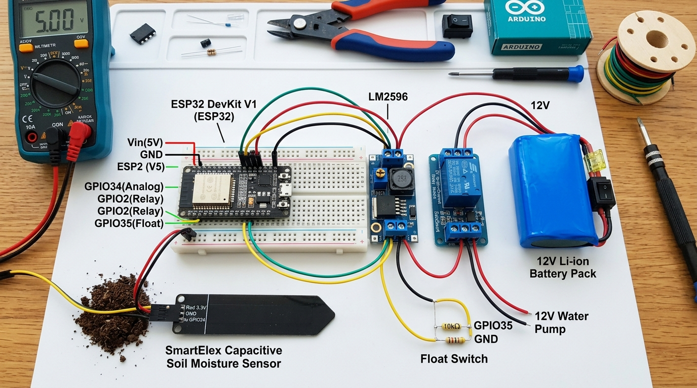
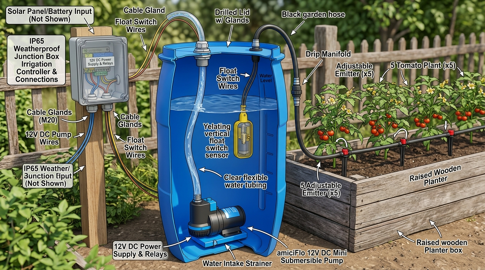

# 🛠️ AgriAgent — Step-by-Step Hardware Assembly & Wiring Guide

This guide explains exactly how every single physical component connects together, wire-by-wire, pin-by-pin.

---

## 📸 Visual 1: Complete Bench Circuit Wiring

---

## 📸 Visual 2: Drum, Pump & Plumbing Layout

---

## ⚡ The Golden Rule (Read Before Powering On!)

> [!CAUTION]
> **NEVER connect the LM2596 Buck Converter to the ESP32 until you test it with your multimeter first!**
> 
> The buck converter arrives from the factory outputting arbitrary voltage (sometimes 10V–11V). If you connect 11V to the ESP32 VIN pin, it will instantly destroy the ESP32.
> 
> **Always do this first:**
> 1. Connect Battery (+) and (-) to LM2596 `IN+` and `IN-`.
> 2. Put Multimeter probes on LM2596 `OUT+` (red probe) and `OUT-` (black probe).
> 3. Turn the tiny brass screw on the blue potentiometer counter-clockwise using a small screwdriver until the multimeter reads **exactly 5.00V**.
> 4. Only once it is locked at 5.00V, connect `OUT+` to your ESP32 `VIN` pin!

---

## 🔌 Pin-by-Pin Wiring Table (Plain English)

### 1. Power Distribution (Battery ➔ Buck Converter ➔ ESP32 & Relay)

| From Component | Pin / Terminal | To Component | Pin / Terminal | Wire Color / Type | What It Does |
|---|---|---|---|---|---|
| **12V Battery Pack** | Red Wire (+) | **Inline Fuse Holder** | Input Wire | Solder / Crimp | Protects circuit against short circuits |
| **Inline Fuse Holder** | Output Wire | **LM2596 Buck** | `IN+` Screw Terminal | Red Wire | Delivers 12V through fuse |
| **12V Battery Pack** | Black Wire (-) | **LM2596 Buck** | `IN-` Screw Terminal | Black Wire | Common Battery Ground |
| **LM2596 (set to 5.0V)** | `OUT+` Terminal | **ESP32 DevKit** | `VIN` Pin | Red Jumper | Powers ESP32 with regulated 5V |
| **LM2596 (set to 5.0V)** | `OUT+` Terminal | **Relay Module** | `VCC` Pin | Red Jumper | Powers relay electromagnet coil |
| **LM2596** | `OUT-` Terminal | **ESP32 DevKit** | `GND` Pin | Black Jumper | Common Ground reference |
| **LM2596** | `OUT-` Terminal | **Relay Module** | `GND` Pin | Black Jumper | Common Ground reference |

---

### 2. Sensors Wiring (Moisture & Float Switch)

| From Component | Pin / Terminal | To Component | Pin / Terminal | Wire Color | What It Does |
|---|---|---|---|---|---|
| **Soil Sensor** | `VCC` Pin | **ESP32** | `3.3V` Pin | Red Jumper | 3.3V power (do NOT connect to 5V!) |
| **Soil Sensor** | `GND` Pin | **ESP32** | `GND` Pin | Black Jumper | Ground reference |
| **Soil Sensor** | `AOUT` Pin | **ESP32** | `GPIO34` Pin | Yellow Jumper | Sends analog voltage (0V–3V) |
| **Float Switch** | Wire 1 | **ESP32** | `GPIO35` Pin | Yellow Jumper | Digital level signal |
| **Float Switch** | Wire 2 | **ESP32** | `GND` Pin | Black Jumper | Ground connection |
| **10kΩ Resistor** | Leg 1 | **ESP32** | `GPIO35` Pin | Resistor Leg | **Pull-up resistor:** ensures clean 3.3V when float switch is open |
| **10kΩ Resistor** | Leg 2 | **ESP32** | `3.3V` Pin | Resistor Leg | Connected to 3.3V rail |

---

### 3. Pump Actuator Wiring (Relay ➔ 12V amiciFlo Submersible Pump)

| From Component | Pin / Terminal | To Component | Pin / Terminal | Wire Color | What It Does |
|---|---|---|---|---|---|
| **ESP32** | `GPIO25` Pin | **Relay Module** | `IN` Pin | Green / Blue Jumper | ESP32 triggers relay switch |
| **12V Battery (+) [after fuse]** | Tap into 12V line | **Relay Module** | `COM` (Common) Screw Terminal | Red 18AWG Wire | High current 12V power path |
| **Relay Module** | `NO` (Normally Open) Terminal | **amiciFlo Pump** | Red Wire (+) | Red Wire | Delivers 12V to pump ONLY when relay closes |
| **amiciFlo Pump** | Black Wire (-) | **12V Battery (-)** | Direct to Battery Ground | Black Wire | Completes 12V pump circuit |
| **1N4007 Diode** | Silver Stripe (Cathode) | **Relay `NO` / Pump (+)** | Solder across terminals | Diode Lead | **Flyback protection:** absorbs coil voltage spike when pump shuts off |
| **1N4007 Diode** | Plain End (Anode) | **Pump (-)** | Solder across terminals | Diode Lead | Connects to pump ground |

---

## 🚰 Drum & Plumbing Setup (Outdoor Physical Assembly)

1. **Drum Prep:**
   * Drill two holes in the plastic lid of your **50L drum**:
     * Hole 1: For the **water hose** (fit a hose connector / barb).
     * Hole 2: Fitted with a **PG7 cable gland** for the pump and float switch wires.
2. **Dropping the Pump:**
   * Connect clear flexible 8mm tubing to the **amiciFlo 12V pump outlet**.
   * Drop the pump all the way down to the **bottom floor** of the 50L drum.
   * Route the tubing up and out through Hole 1 in the lid.
3. **Suspending the Float Switch:**
   * Hang the **OCEAN STAR Float Switch** inside the drum such that the float hangs ~4 to 6 inches above the pump intake.
   * When water drops to within 4 inches of the bottom, the float drops, opening the switch and triggering an immediate **"LOW"** alert, preventing the pump from ever running dry!
4. **Connecting the Drip Line:**
   * Outside the drum, connect the water hose to your **drip irrigation manifold**.
   * Stake **5 adjustable drip nozzles** into the soil, one directly at the root zone of each of your 5 tomato plants.

---

## 📦 Enclosure Assembly (IP65 Box on the Post)

1. Mount the **JJB-150110 IP65 Box** on a wooden stake next to your garden bed.
2. Drill holes in the bottom wall of the box and screw in your **PG7 cable glands**.
3. Feed the cables through the glands:
   * Gland 1: Soil Moisture Sensor cable (3 wires).
   * Gland 2: Float Switch cable (2 wires).
   * Gland 3: Pump Power cable (2 wires).
4. Place the **ESP32**, **Relay**, **Buck Converter**, and **12V Battery Pack** inside using mounting standoffs or double-sided industrial foam tape.
5. Tighten the cable glands securely to maintain the **IP65 weatherproof seal** against outdoor rain!
